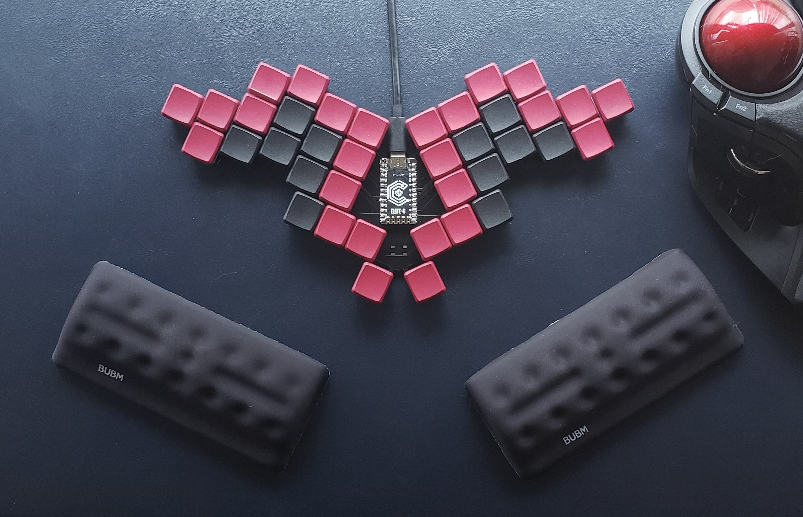
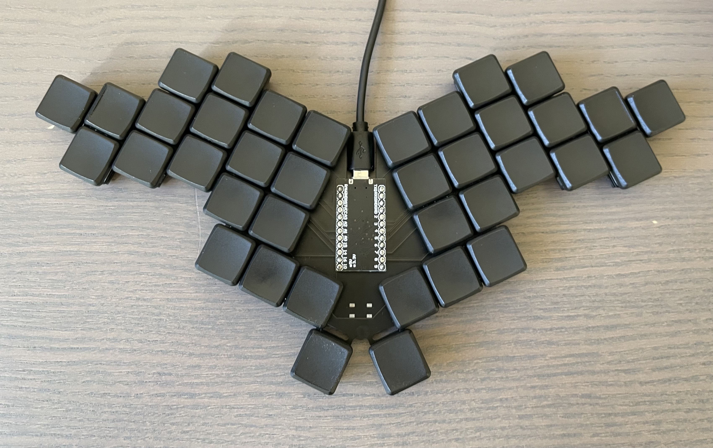
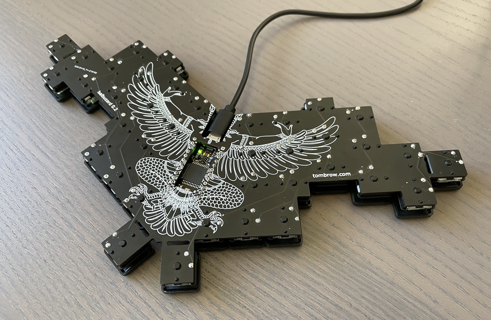
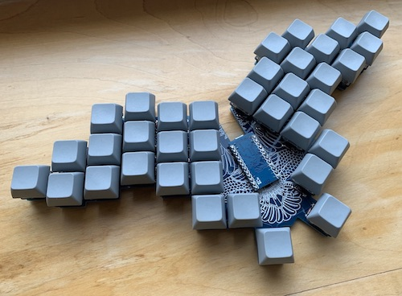

# Balbuzard

Balbuzard is a compact, ergonomic keyboard with 34–38 keys.



## How do you type on that?
I've used Balbuzard as my main keyboard since 2019. My keymap looks like this:


_Mod 1_ and _Mod 2_ activate alternate layers of the keymap, which contain symbols, arrows, backspace, etc.

## Versions

### [0.2: Low-profile](https://github.com/brow/balbuzard/releases/tag/v0.2)



- 34–38 keys
- Compatible with Choc (low-profile) switches
- SMD diodes concealed within switches
- Silkscreen on bottom
- Tighter key spacing
- Viewing window under microcontroller
- Adjustments to positions of columns and thumb keys

### [0.1: Classic](https://github.com/brow/balbuzard/releases/tag/v0.1)



- 36 keys
- Compatible with MX, Alps, and Choc (low-profile) switches
- Through-hole diodes nestled between switches
- Silkscreen on top


## Using this repository

This repo contains the [Ergogen](https://github.com/mrzealot/ergogen) configuration that generates the KiCad PCB file.

Assuming you have [npm installed](https://www.npmjs.com/get-npm):

``` sh
git clone --recursive git@github.com:brow/balbuzard.git
cd balbuzard
make
```

Find the generated PCB at `output/pcbs/main.kicad_pcb`.


