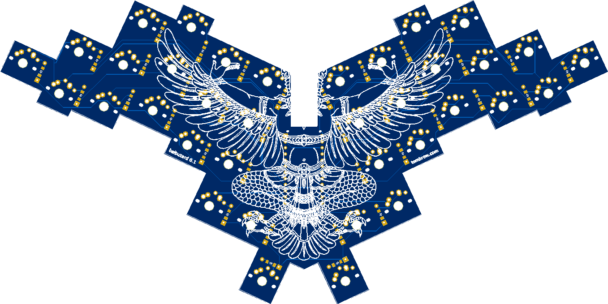
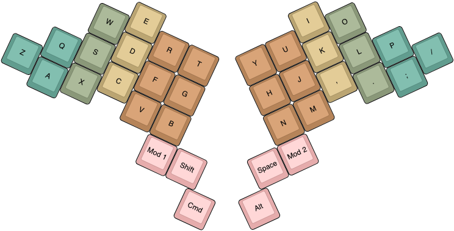

# Balbuzard


Balbuzard is a 36-key keyboard with a PCB. This repository contains the [Ergogen](https://github.com/mrzealot/ergogen) configuration that generates the KiCad PCB file.

## Usage

Assuming you have [npm installed](https://www.npmjs.com/get-npm):

``` sh
git clone --recursive git@github.com:brow/balbuzard.git
cd balbuzard
make
```

Find the generated PCB at `output/pcbs/main.kicad_pcb`.



## How do you type on that?

My keymap looks like this. The colors indicate which finger I use to hit each key.


